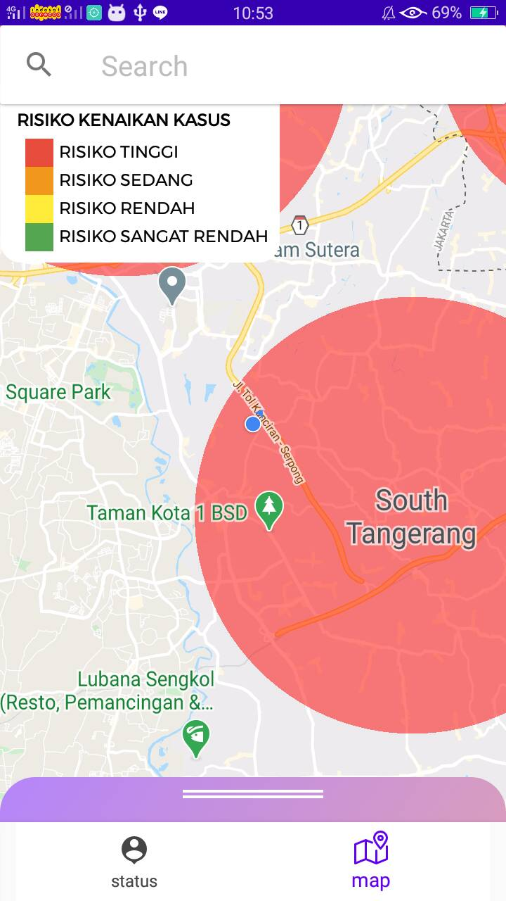
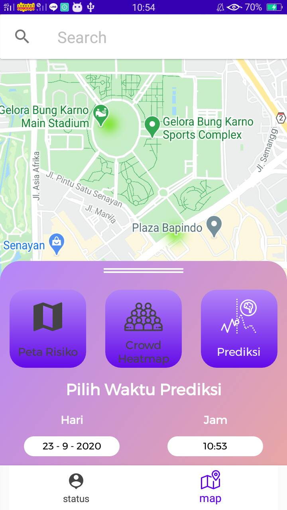

# Crowdmap
Mobile application made for Gemastik 13 2020
  

Real-time heatmap and person detection
<table>
  <tr>
    <td>Homepage</td>
     <td>Person detection to update heatmap</td>
     <td>Heatmap presented in maps</td>
  </tr>
  <tr>
    <td></td>
    <td></td>
    <td></td>
  </tr>
 </table>

  
Crowd prediction using prophet time series algorithm
<table>
  <tr>
    <td>Covid-19 risk map</td>
     <td>Feature to predict crowd presented in heatmap</td>
     <td>Feature to predict crowd presented in heatmap(1)</td>
  </tr>
  <tr>
    <td></td>
    <td></td>
    <td></td>
  </tr>
 </table>
